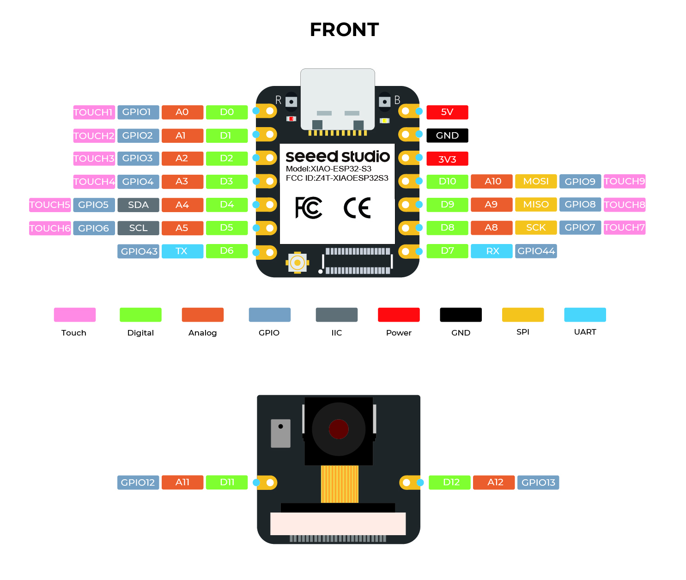

# esp32Remote
'Out of tree' project that modifies a value when a rotary encoder is rotated. Sends the value via MQTT.

Uses the [Seeed XIAO ESP32 S3](https://docs.zephyrproject.org/latest/boards/seeed/xiao_esp32s3/doc/index.html) using the Zephyr RTOS. It should be straightforward to adapt to other ESP32S3 boards.

## Setup
This assumes you've already installed & configured Zephyr.

## Working version
Currently need to be
```
    git checkout v3.6-branch
```

## Initialize environment:
As normal, source the environment:
```
    source ../zephyrproject/.venv/bin/activate
    source ../zephyrproject/zephyr/zephyr-env.sh
    source ../zephyrproject/zephyr/scripts/west_commands/completion/west-completion.bash
```
## Binary blobs
Espressif HAL requires binary blobs for peripherals to work. Run the command below to retrieve those files.
```
    west blobs fetch hal_espressif
```
## Build:
Build application & bootloader
```
    west build -p always -b xiao_esp32s3/esp32s3/procpu
```
## Flash
```
    west flash
```

## Modify config
 west build -t guiconfig --board xiao_esp32s3/esp32s3/procpu

## References
- [Espressif PCNT](https://docs.espressif.com/projects/esp-idf/en/latest/esp32s3/api-reference/peripherals/pcnt.html)
- [Zephyr PCNT](https://docs.zephyrproject.org/latest/build/dts/api/bindings/sensor/espressif,esp32-pcnt.html)
- [Driver source code](https://github.com/zephyrproject-rtos/zephyr/blob/main/drivers/sensor/espressif/pcnt_esp32/pcnt_esp32.c)

## Pinout:



## Rotary encoder:


## Pin level:
### Clockwise Rotation
Blue: SIG/ GPIO1, Yellow: CTRL/ GPIO3


### Counter Clockwise Rotation
Blue: SIG/ GPIO1, Yellow: CTRL/ GPIO3

